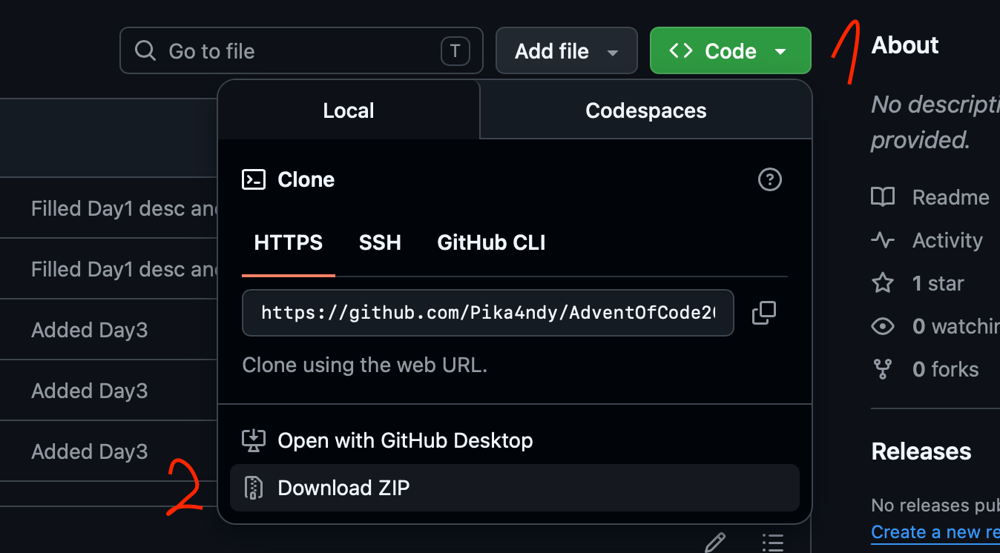

# Advent Of Code 2025

This repository contains the code I used to solve the [Advent Of Code 2025](https://adventofcode.com/2025) puzzles.

In each source code, two common functions are present:

1. The `main` function which contains the algorithm solving the input file usually copied from the `sampleTest` function
2. And the `sampleTest` function where I search the way to solve the puzzle by experimenting on the sample input from the statement

> Note: Every file should be commented to explain the ideas of the algorithm, if it hasn't been done yet, I will do it when I finish all the days.

Here are the links to the different source code of each day:

- [Day 1](./Day1/Day1.py)
- [Day 2](./Day2/Day2.py)
- [Day 3](./Day3/Day3.py)
- [Day 4](./Day4/Day4.py)

## About this repository

> No AI, nor results provided by other developers was used while resolving these puzzles, It is the main point of solving them anyway.

## How to download and use it

### Requirements

- [Python](https://www.python.org/downloads/) ver. 3.10 or more: to run the code
- [git](https://git-scm.com/install/)*(mandatory)*: for cloning/downloading this repository
- Any IDE but in my case, I am using [Visual Studio Code](https://code.visualstudio.com/download) to view the code, modify and run it

> Note: Python has a built-in IDE called IDLE which may be useful if you don't want to deal with VS Code extensions

If you have any issues installing these requirements got to [Issues section](#if-you-meet-issues).

### Steps (with requirements )

1. **Open** your terminal, **go** to the directory you want to download it and **clone** this repository by writing the following command in your terminal:

    ```bash
    git clone https://github.com/Pika4ndy/AdventOfCode2025.git
    ```

2. **Create a Python virtual environment and activate it** by writing the following in your terminal:

    ```bash
    python3 -m venv .venv
    source .venv/bin/activate
    ```

3. **Run** any code with:

    ```bash
    python3 [path to the file]
    ```

For example:

```bash
python3 Day1/Day1.py
```

To run the Day 1 code, and receive the result in the terminal.

### If you meet issues

You can download the repository **without using git** by clicking on the download zip in the "Code" menu above the files in this main page.



## Contributions/Questions

If you have a suggestion or any questions about my code, feel free to open an issue. I would be happy to interact with you.
